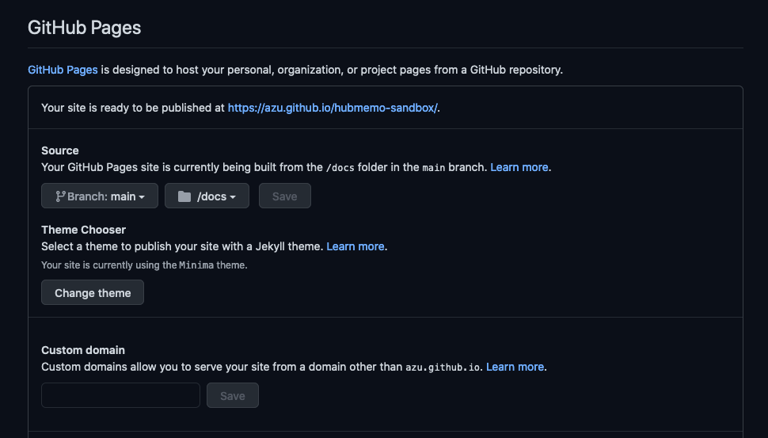

# Setup

## Deploy

### GitHub Pages

#### `github.com/<username>/<username>.github.io`

If you use `<username>.github.io` as repository name, you have already almost setup!

1. Move your repository's settings([`https://github.com/<user>/<repo>/settings`)
2. Enable GitHub Pages
   - `Branch: main` > `/docs`



:memo: After a setup, You need to commit something to your repository for building page

- [Getting Started with GitHub Pages · GitHub Guides](https://guides.github.com/features/pages/)

### `github.com/<username>/<repo>`

If you use `github.com/<username>/<repo>` as repository name, you need to additional setup!

1. Move your repository's settings([`https://github.com/<user>/<repo>/settings`)
2. Enable GitHub Pages
   - `Branch: main` > `/docs`
   


3.  Change [`docs/_config.yml`](../docs/_config.yml)'s `baseurl`

````yml
baseurl: "/<repo>" # the subpath of your site, e.g. /blog
url: "" # the base hostname & protocol for your site, e.g. http://example.com
````

### Netlify

Guide to deploy to [Netlify](https://www.netlify.com/).

1. Connect your repository to Netlify
   - See <https://docs.netlify.com/cli/get-started/>
2. Create following `netlify.toml`:

```toml
# example netlify.toml
[build]
  base = "docs/"
  command = "jekyll build"
  functions = "functions"
  publish = "_site"

  ## Uncomment to use this redirect for Single Page Applications like create-react-app.
  ## Not needed for static site generators.
  #[[redirects]]
  #  from = "/*"
  #  to = "/index.html"
  #  status = 200

  ## (optional) Settings for Netlify Dev
  ## https://github.com/netlify/cli/blob/master/docs/netlify-dev.md#project-detection
  #[dev]
  #  command = "yarn start" # Command to start your dev server
  #  port = 3000 # Port that the dev server will be listening on
  #  publish = "dist" # Folder with the static content for _redirect file
  ## more info on configuring this file: https://www.netlify.com/docs/netlify-toml-reference/
```

3. Change [`docs/_config.yml`](../docs/_config.yml)'s `baseurl`

````yml
baseurl: "/" # the subpath of your site, e.g. /blog
url: "https://your-netlify-name.netlify.app" # the base hostname & protocol for your site, e.g. http://example.com
````

4. Set `WEBSITE_BASE_URL` to [`dispatch-update-memo.yml`](../.github/workflows/dispatch-update-memo.yml)

```diff
      # Create draft and create pull request
      - name: Create Draft Post
        run: yarn install && yarn ts-node index.ts
        env:
          PAYLOAD: ${{ toJSON(github.event.client_payload) }}
          PRIVATE: ${{ github.event.repository.private }}
+          WEBSITE_BASE_URL: "https://your-netlify-name.netlify.app"
```
