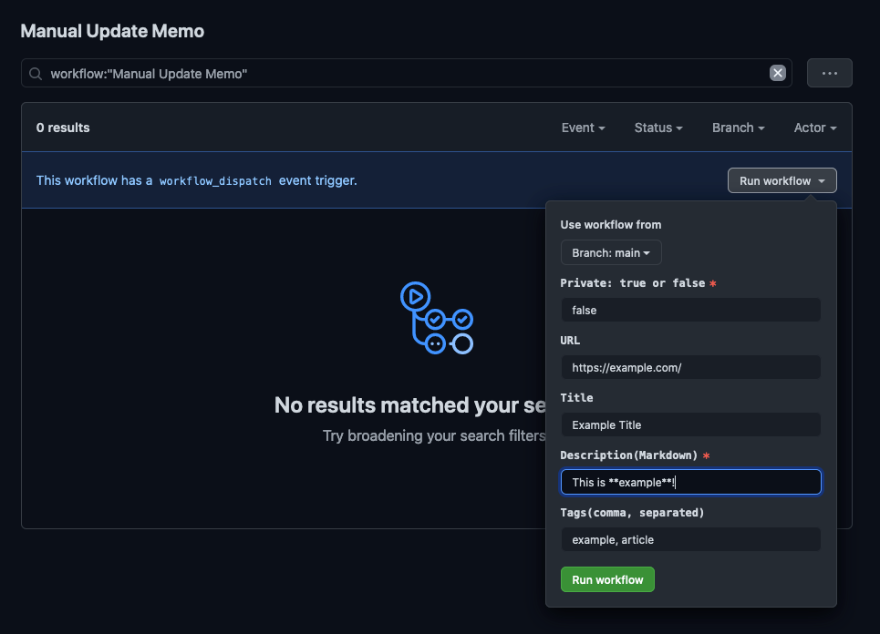

# Usage

This guide describes about "Memo" and "Post".

- Memo: It is a collection of snippet data
- Post: It is an article for publishing

## Memo Structure

HubMemo represent a memo as JSON object for machine-readable.

```ts
type Memo = {
  // unique key
  url: string;
  private: boolean,
  title: string;
  content: string;
  tags: string[];
  date: string;
  viaURL?: string;
  relatedItems?: { title: string, url: string }[];
  media: { url: string }[];
}
```

Also, HubMemo create a memo as Markdown for human-readable in same directory of JSON.

```markdown
## [{title}]({url})

{content}

{media}
{relatedItems}
```

## Update Memo

HubMemo use GitHub Actions for updating flow.

### Via HTTP API

[dispatch-update-memo.yml](../.github/workflows/dispatch-update-memo.yml) Action create/update a memo.

**Requirements**

You need to get your GitHub Personal Access Token.

- Visit <https://github.com/settings/tokens/new>
- Create a token with `repo` permission
- Copy it!

You can call this action via GitHub API.

```shell
#!/usr/bin/env bash
# Need to change!
YOUR_REPO="azu/hubmemo"
# Your GitHub Personal Token
GITHUB_TOKEN="xxxxx"
curl -vv \
    -H "Authorization: token ${GITHUB_TOKEN}" \
    -H "Accept: application/vnd.github.everest-preview+json" \
    "https://api.github.com/repos/${YOUR_REPO}/dispatches" \
    -d '{"event_type": "update-memo", "client_payload": {"item":{"title":"example","url":"https://example.com","content":"description for example","tags":["example"]}}}'
```

### Via Git

[watch-folder-update-memo.yml](../.github/workflows/watch-folder-update-memo.yml) Action create a memo from json file if you add the json file to `watch_folder/update-memo/` directory.

```shell
echo '{"item":{"title":"example","url":"https://example.com","content":"description for example","tags":["example"]}}' > watch_folder/update-memo/example.json
git add watch_folder/update-memo/example.json
git commit -m "new memo"
git push
```

For more details, see [Watch Folder](../watch-folder) documentation.

### Via GUI

[manual-update-memo.yml](../.github/workflows/watch-folder-update-memo.yml) provide simple GUI for creating a memo.

1. Visit <https://github.com/<username>/<repo>/actions?query=workflow%3A%22Manual+Update+Memo%22>
2. Click "Run workflow"
3. Input and submit



### Via Issue

[issue-update-memo.yml](../.github/workflows/issue-update-memo.yml) Action create  a memo from GitHub issue.

1. New Issue
2. Click "New Memo" template
3. Create an issue, and then [issue-update-memo.yml](../.github/workflows/issue-update-memo.yml) Action create memo from the issue.

Mapping memo with Issue.

- `title`: Issue Title
- `url`: First `http://` url in Issue body
  - Issue body should start with `<url>` or `url` link.
- `content`: Rest content of Issue body
- `tags`: Issue's label starts `Tag:???`
  - If the issue labeled with `Tag:example`, convert it to `tags: ["example"]` 
- `private`: If the issue labeled with `Type:Private`, it to be `true`

Issue body should be following:

```
<https://example.com>

Description of example.com
```

:memo: `<https://...>` is markdown link syntax.

Tips: `title` and `body`  parameter as placeholder.

`https://github.com/<username>/<repo>/issues/new?assignees=&labels=Type%3AMemo&template=memo.md&title=%3Ctitle%3E&body=%3Curl%3E%0ddescription`

Example: [New Example title · Issue #4 · azu/hubmemo-sandbox](https://github.com/azu/hubmemo-sandbox/issues/4)

## Publish Post

[dispatch-update-memo.yml](../.github/workflows/dispatch-update-memo.yml) create Draft Pull Request automatically when updating memo.

1. See your Pull Requests tabs
2. Edit the Pull Request
3. Merge it!
4. Automatically publish this content to [your setup provider](./SETUP.md)

HubMemo help you to edit Draft PR via [`.github/workflows/update-draft-post.yml`](../.github/workflows/update-draft-post.yml).

- if PR title starts `YYYY-MM-DD: ~`, change the `draft.md` to `YYYY-MM-DD-<slug>.md`
- if the content's `title: ~` starts with `YYYY-MM-DD: ~`, change the `draft.md` to `YYYY-MM-DD-<slug>.md`
- if PR body is changed, add the PR's body as headline into the content
